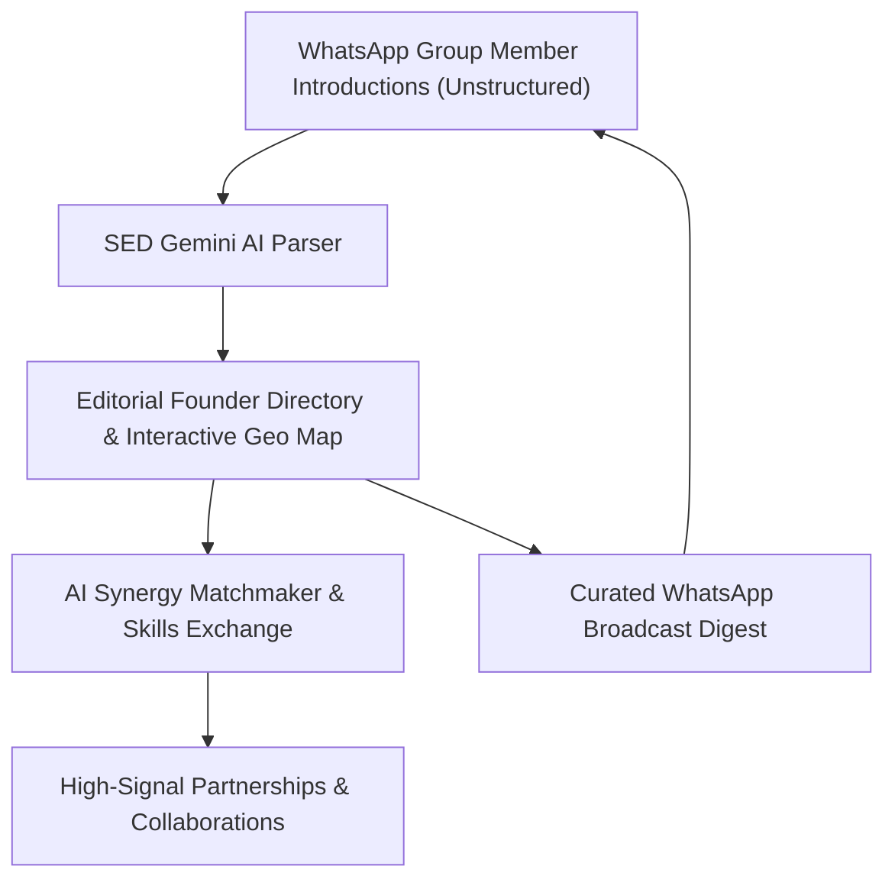

# 01 · PRODUCT AND ROADMAP
> **Smart Entrepreneurs Directory (SED)** — Product Strategy, Problem Matrix & Execution Roadmap  
> **Target Audience:** Startup Founders, Entrepreneurs & WhatsApp Business Community Masterminds  
> **Visual Archetype:** Editorial / Minimal (Spacious, Typography-Focused, Sophisticated)  
> **Deployment Target:** Vercel

---

## 1. Executive Summary & Core Value Proposition

WhatsApp is the default operating layer for high-caliber entrepreneur networks and founder masterminds globally. However, chat stream architecture suffers from severe structural entropy:
- **Lost Introductions:** Member introductions scroll off and are lost within hours.
- **Zero Onboarding Context:** New founders entering a group have no discovery mechanism to identify veteran members, their industries, core pain points, or geographic locations.
- **Under-leveraged Synergy:** High-value partnerships, vendor recommendations, and cross-border collaborations fall through the cracks due to conversational noise.

**Smart Entrepreneurs Directory (SED)** converts messy WhatsApp group chats into a refined, editorial, AI-enhanced member directory and collaboration exchange. It enables founders and admins to quickly discover peer capabilities, initiate high-signal partnerships, and maintain a high-trust network.

---

## 2. Target User Personas & Pain Matrix

| User Segment | Core Pain Points | SED Solution & Value |
|---|---|---|
| **New Community Members** | • Blind onboarding with no visibility into existing group members. • Unsure who to contact for sector-specific guidance or co-founders. • Unaware of founders in their local city or region. | • Instant searchable directory by industry, stage, and location. • Interactive Leaflet Map with city and country clustering. • Direct WhatsApp one-click outreach with tailored icebreakers. |
| **Active & Veteran Members** | • Repeating introductory pitches repeatedly in group chat. • Historical intro buried in unindexed chat logs. • Sourcing reliable vendors or domain specialists without group spam. | • Persistent founder dossier with "Looking For" vs "Can Help With". • Skills Exchange bulletin board for high-intent asks. • AI Matchmaker for bilateral compatibility scoring. |
| **Community Admins & Curators** | • Heavy manual effort welcoming and orienting new cohorts. • No visibility into aggregated community demographic health. • Maintaining member retention and high-signal discussions. | • Bulk WhatsApp chat export batch ingestion in seconds. • Community Dashboard analytics (stages, sectors, geography). • Automated Weekly WhatsApp Broadcast Digest generator. |

---

## 3. Core Product Capabilities

### 3.1. Editorial Member Discovery & Geospatial Intelligence
- **Multi-Dimensional Search:** Real-time debounced search across names, ventures, roles, elevator pitches, offers, and needs.
- **Stage & Sector Filtering:** Faceted filtering across business maturity (`Idea`, `Starting`, `Running`, `Growing`) and 30+ standardized industry sectors.
- **Interactive Global Map (Leaflet):** Sophisticated map visualization with cluster drilldowns by country and city to foster regional meetups.

### 3.2. Multilingual AI Intake Engine (Google Gemini)
- **Single & Bulk Message Parsing:** Ingests raw, unstructured, multilingual WhatsApp text (English, Arabic, French, Spanish, Portuguese, Urdu, etc.) and extracts structured profiles:
  - Full Name & Current Role
  - Venture Concept & Elevator Pitch
  - Growth Stage & Core Industry Tags
  - Bottlenecks ("Looking For") & Superpowers ("Can Help With")
  - City, Country & Direct Contact Channels

### 3.3. Autonomous AI Matchmaker
- **Synergy Scoring:** Evaluates founder compatibility scores (0–100%) based on bilateral capability alignments.
- **Strategic Thesis:** Generates specific rationale explaining why two founders should collaborate (e.g., market expansion, supplier synergy, complementary skillsets).
- **Personalized Icebreaker:** Creates ready-to-send, courteous WhatsApp outreach copy.

### 3.4. Skills & Opportunity Exchange
- **Supply & Demand Board:** Dedicated bulletin for active "Offers" (mentoring, tools, domain expertise) and "Needs" (fundraising, hiring, beta testers).
- **Direct Connect:** Seamless integration with WhatsApp click-to-chat links.

### 3.5. Community Analytics & Broadcast Digests
- **Ecosystem Health Metrics:** Visual funnel of member stages, top industry sectors, and regional distribution.
- **Weekly Digest Generator:** Generates formatted WhatsApp broadcast digests summarizing recent joiners and top collaboration asks.

---

## 4. Sprint Roadmap & Execution Backlog

### Sprint 1: Editorial / Minimal Visual Polish *(Active)*
- [x] Configure Editorial / Minimalist typography scale (Fraunces + Plus Jakarta Sans + JetBrains Mono).
- [x] Implement spacious layout hierarchy, subtle borders, and warm stone canvas.
- [ ] Refine card whitespace and micro-elevation transitions for effortless scannability.
- [ ] Ensure full dark mode consistency with warm obsidian surfaces.

### Sprint 2: Directory, Map & Exchange Enhancements
- [ ] Optimize multi-tag facet filtering with instant debounced updates.
- [ ] Upgrade Leaflet Map with custom minimalist pins and city-level drilldown.
- [ ] Refine Skills Exchange board with tabbed Offer/Need toggles and category chips.
- [ ] Streamline vCard export and shareable founder pass preview.

### Sprint 3: AI Intelligence Engine & Batch Ingestion
- [ ] Optimize Gemini prompt engineering for noisy WhatsApp chat exports.
- [ ] Enhance Matchmaker bilateral scoring algorithm with custom synergy rationale.
- [ ] Add one-click export for WhatsApp markdown weekly broadcasts.
- [ ] Maintain JSON backup snapshot import/export with schema validation.

### Sprint 4: Performance, Security & Vercel Deployment
- [ ] Verify Vite code-splitting and dynamic chunking.
- [ ] Validate Vercel SPA routing and security headers in `vercel.json`.
- [ ] Verify unit test coverage for storage CRUD and parsing helpers.
- [ ] Cross-browser & mobile viewport verification (iOS Safari, Chrome, Desktop).
