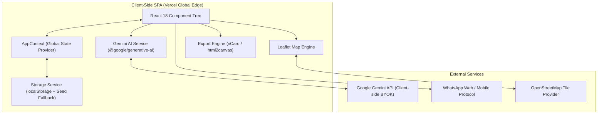

# 02 · SYSTEM ARCHITECTURE
> **Smart Entrepreneurs Directory (SED)** — System Architecture, Component Map & Data Schemas  
> **Framework:** React 18 (Vite 6 SPA) | **Hosting:** Vercel

---

## 1. High-Level Architecture Overview



---

## 2. Tech Stack & Bill of Materials (BOM)

| Category | Technology | Version | Architectural Rationale |
|---|---|---|---|
| **Core Framework** | React + ReactDOM | `^18.3.1` | Declarative component model with concurrent rendering |
| **Tooling & Bundler** | Vite | `^6.0.5` | Instant HMR, ESM compilation, sub-second production builds |
| **Styling Engine** | Tailwind CSS | `^3.4.17` | Utility-first styling configured with Editorial/Minimal tokens |
| **Post-Processing** | PostCSS + Autoprefixer | `^8.5.1` | Cross-browser CSS compatibility |
| **Iconography** | Lucide React | `^0.460.0` | Clean, crisp, lightweight SVG vectors |
| **Geospatial Mapping** | Leaflet | `^1.9.4` | High-performance interactive world map with clustering |
| **AI Engine** | `@google/generative-ai` | `^0.21.0` | Gemini Flash integration for parsing, matchmaking & digests |
| **Contact & Media Export** | `html2canvas` & `vCard` | `^1.4.1` | Generates downloadable .vcf contacts and founder passes |
| **Utilities** | `date-fns` & `uuid` | `^4.1.0` / `^11.0.3` | Immutable date calculations and RFC4122 v4 unique identifiers |
| **Testing** | Vitest + RTL + JSDOM | `^5.0.1` | Fast unit & component integration test suite |

---

## 3. Directory & Component Hierarchy

```
Smart Directory/
├── .context/                          # Context matrix (00 to 05)
├── public/                            # Static assets, icons, manifest
├── src/
│   ├── main.jsx                       # Entry point & root DOM mounting
│   ├── App.jsx                        # Shell layout, tab router & notification toasts
│   ├── index.css                      # Base CSS variables, typography & Tailwind layers
│   │
│   ├── contexts/
│   │   └── AppContext.jsx             # Master provider: members, activeTab, filters, theme, apiKey
│   │
│   ├── components/
│   │   ├── layout/
│   │   │   ├── Header.jsx             # Brand identity, search status, theme toggle
│   │   │   └── Sidebar.jsx            # Multi-view navigation tabs with counter badges
│   │   │
│   │   ├── directory/
│   │   │   ├── Directory.jsx          # Member grid view, search bar, active filter pills
│   │   │   ├── ProfileCard.jsx        # Editorial bento founder card with offer/need blocks
│   │   │   ├── EmptyState.jsx         # Clean empty state illustrations and reset CTAs
│   │   │   └── FilterPanel.jsx        # Multi-select facet filter (stage, tags, country)
│   │   │
│   │   ├── parser/
│   │   │   ├── AIParser.jsx           # Single intro & bulk WhatsApp chat parser
│   │   │   ├── ManualForm.jsx         # Offline-friendly manual profile entry form
│   │   │   └── EditMemberModal.jsx    # Modal editor for updating founder records
│   │   │
│   │   ├── matchmaker/
│   │   │   ├── AIMatchmaker.jsx       # Selector for subject member vs directory cohort
│   │   │   └── MatchCard.jsx          # Score bar, synergy rationale & 1-click WhatsApp pitch
│   │   │
│   │   ├── map/
│   │   │   ├── WorldMapView.jsx       # Leaflet interactive world map with country clusters
│   │   │   └── EgyptIllustratedMap.jsx# Regional drilldown map component
│   │   │
│   │   ├── dashboard/
│   │   │   └── CommunityDashboard.jsx # Analytics: stage funnel, top skills, geo distribution
│   │   │
│   │   ├── digest/
│   │   │   └── WeeklyDigest.jsx       # WhatsApp broadcast generator with markdown copy
│   │   │
│   │   ├── admin/
│   │   │   └── AdminPanel.jsx         # PIN authentication, JSON backup snapshot import/export
│   │   │
│   │   ├── businesscard/
│   │   │   └── BusinessCardModal.jsx  # Shareable digital founder business card preview
│   │   │
│   │   └── common/
│   │       ├── Modal.jsx              # Accessible overlay modal shell with backdrop blur
│   │       ├── LoadingSpinner.jsx     # Minimalist loading indicators
│   │       └── QRCodeSVG.jsx          # SVG QR code generator for instant contact scanning
│   │
│   └── utils/
│       ├── constants.js               # Enums (STAGES, INDUSTRY_TAGS, COUNTRY_FLAGS, SEED_MEMBERS)
│       ├── gemini.js                  # Gemini AI API wrapper (parseIntro, runMatchmaker, generateDigest)
│       ├── helpers.js                 # Slugification, sanitization, phone formatting, vCard generator
│       ├── storage.js                 # LocalStorage CRUD, data migration & JSON snapshot handlers
│       └── session.js                 # Admin session state and timeout management
```

---

## 4. Core Data Schemas & Models

### 4.1. Member Model (`Member`)

```typescript
interface Member {
  id: string;                      // RFC4122 UUID v4
  name: string;                    // Full display name
  role: string;                    // Current headline / role (e.g. "Founder & CTO")
  business: string;                // Company name + concise elevator pitch
  stage: 'idea' | 'starting' | 'running' | 'growing';
  lookingFor: string;              // High-intent needs from the community (bottlenecks)
  canHelp: string;                 // Superpowers & services offered to the community
  location: {
    country: string;               // Normalized country name (maps to ISO flag/coordinates)
    city: string;                  // City or region
    district?: string;             // Optional neighborhood/district
  };
  phone?: string;                  // Clean phone number (e.g. "+971501234567")
  email?: string;                  // Optional contact email
  linkedin?: string;               // LinkedIn profile URL or handle
  website?: string;                // Optional URL
  tags: string[];                  // 2–6 normalized tags from INDUSTRY_TAGS
  originalLanguage: string;        // ISO 639-1 code (e.g. "en", "ar", "es")
  originalText?: string;           // Raw original message for audit / re-parse
  status?: 'active' | 'pending';   // Moderation status
  createdAt: string;               // ISO 8601 UTC timestamp
  updatedAt: string;               // ISO 8601 UTC timestamp
}
```

### 4.2. Skills Exchange Post (`SkillsExchangePost`)

```typescript
interface SkillsExchangePost {
  id: string;                      // RFC4122 UUID v4
  type: 'offer' | 'need';          // Binary marketplace category
  title: string;                   // Concise request / offer headline
  description: string;             // Detailed description of requirement or offering
  tags: string[];                  // Domain tags (e.g. "Marketing", "Fundraising", "Dev")
  contact: string;                 // WhatsApp phone number or handle
  authorName: string;              // Creator's name (linked to Member.name if matched)
  memberId?: string;               // Optional link to Member ID
  createdAt: string;               // ISO 8601 UTC timestamp
  expiresAt?: string;              // Optional expiration timestamp
}
```

### 4.3. AI Match Result (`MatchResult`)

```typescript
interface MatchResult {
  targetMemberId: string;          // ID of evaluated peer member
  targetMemberName: string;        // Name of peer
  synergyScore: number;            // Normalized integer (0 to 100)
  synergyRationale: string;        // Strategic rationale explaining why they should connect
  collaborationPoints: string[];   // Bullet points of actionable collaboration opportunities
  suggestedIcebreaker: string;     // Ready-to-send personalized WhatsApp outreach message
}
```

---

## 5. State Management & Data Persistence

- **State Container (`AppContext`):** Centralized React Context managing `members`, `activeMembers`, `activeTab`, `filters`, `apiKey`, `theme`, and notifications.
- **Persistence (`storage.js`):** Client-side `localStorage` CRUD with safe try/catch error traps, automatic seed data fallback, and JSON snapshot export/import.
