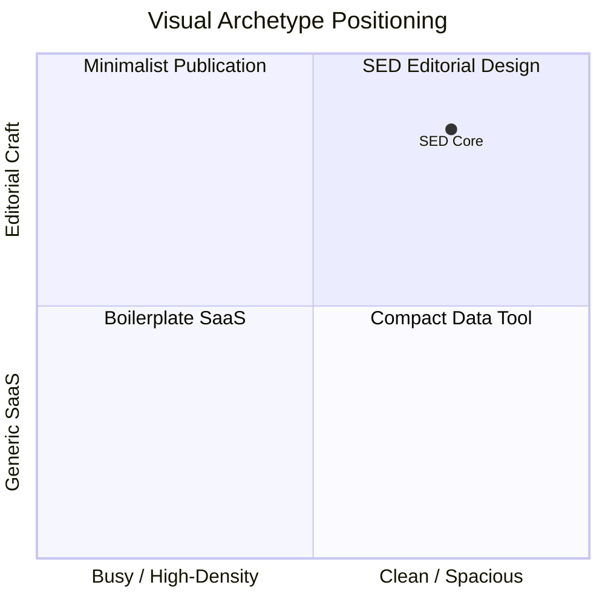

# 03 · DESIGN SYSTEM: EDITORIAL / MINIMAL
> **Smart Entrepreneurs Directory (SED)** — Design Tokens, Typography, Color Matrix & Component Guidelines  
> **Visual Archetype:** Editorial / Minimal (Spacious, Typography-Focused, Sophisticated)

---

## 1. Design Philosophy: The Editorial Archetype

The **Editorial / Minimal** design archetype treats the community directory not as a noisy dashboard, but as a refined, high-signal publication for elite founders:

- **Typography-First Hierarchy:** Expressive editorial display headings (`Fraunces` / `Outfit`) paired with ultra-legible modern sans (`Plus Jakarta Sans`) and crisp monospace details (`JetBrains Mono`).
- **Intentional Whitespace:** Generous internal padding and breathing room, allowing dense founder intelligence (offers, needs, pitches) to be scanned without visual fatigue.
- **Warm Understated Palette:** Warm paper canvas (`#FAFAF7`), rich warm obsidian (`#0C0A09`), subtle stone borders (`#E5E5E5` / `#262626`), with intentional terracotta (`#EA580C`) and synergy emerald (`#059669`) accents.
- **Restrained Depth:** Crisp, quiet borders ($1.5\text{px}$) with soft micro-shadows rather than generic blurry glow effects.

---

## 2. Color Palette & Token Hierarchy

### 2.1. Light Mode Palette (Default)

| Token Name | Tailwind Class / CSS Var | Hex Value | Purpose & Usage |
|---|---|---|---|
| **Canvas Background** | `bg-[#FAFAF7]` / `--bg-canvas` | `#FAFAF7` | Warm editorial paper foundation |
| **Card / Surface Base** | `bg-white` / `--bg-surface` | `#FFFFFF` | Primary card and modal container background |
| **Elevated Surface** | `bg-stone-100` / `--bg-elevated` | `#F5F5F4` | Search inputs, filter bars, sidebar containers |
| **Primary Text** | `text-stone-950` / `--text-primary` | `#0C0A09` | High-contrast editorial titles and founder names |
| **Secondary Text** | `text-stone-600` / `--text-secondary` | `#57534E` | Body text, elevator pitches, descriptions |
| **Muted Text** | `text-stone-400` / `--text-muted` | `#A8A29E` | Timestamps, metadata labels, icon hints |
| **Key Border** | `border-stone-300` / `--border-bold` | `#D6D3D1` | $1.5\text{px}$ crisp container boundaries |
| **Subtle Divider** | `border-stone-200` / `--border-subtle` | `#E7E5E4` | Internal component rules and dividers |
| **Accent Primary (Terracotta)** | `bg-orange-600` / `--accent-primary` | `#EA580C` | Primary CTAs, active highlights, key accents |
| **Accent Warm (Amber)** | `bg-amber-500` / `--accent-warm` | `#F59E0B` | Venture pitch boxes, opportunity highlights |
| **Synergy Accent (Emerald)** | `bg-emerald-600` / `--accent-synergy` | `#059669` | Matchmaker scores, active stage indicators |
| **WhatsApp Brand** | `bg-[#25D366]` / `--brand-whatsapp` | `#25D366` | Direct WhatsApp one-click action buttons |

### 2.2. Dark Mode Palette (Warm Obsidian)

| Token Name | Tailwind Class / CSS Var | Hex Value | Purpose & Usage |
|---|---|---|---|
| **Canvas Background** | `bg-stone-950` / `--bg-canvas` | `#0C0A09` | Deep warm obsidian canvas |
| **Card Surface** | `bg-stone-900` / `--bg-surface` | `#1C1917` | Card surfaces with subtle borders |
| **Elevated Surface** | `bg-stone-850` / `--bg-elevated` | `#1F1C19` | Filter bars, sidebar containers, input fields |
| **Primary Text** | `text-stone-100` / `--text-primary` | `#F5F5F4` | Razor-sharp headings and titles |
| **Secondary Text** | `text-stone-300` / `--text-secondary` | `#D6D3D1` | Readable pitch descriptions |
| **Border Tone** | `border-stone-800` / `--border-bold` | `#292524` | Crisp dark-mode structural delimiters |

---

## 3. Typographic Hierarchy

- **Editorial Serif Display:** `Fraunces`, `Georgia`, `serif` (Used for hero titles, section headlines, and brand identity).
- **Interface Sans:** `Plus Jakarta Sans`, `system-ui`, `sans-serif` (High readability across all viewport sizes).
- **Technical & Metric Mono:** `JetBrains Mono`, `ui-monospace`, `monospace` (Used for synergy scores, timestamps, stage pills, and tag chips).

### Typography Scale

| Style Level | Font Family | Size / Leading | Weight | Usage |
|---|---|---|---|---|
| **Display H1** | Fraunces Serif | `2.25rem (36px)` / `1.15` | `800 ExtraBold` | Hero titles & directory branding |
| **Section H2** | Plus Jakarta Sans | `1.5rem (24px)` / `1.25` | `700 Bold` | Primary view titles (Directory, Matchmaker, Map) |
| **Card Title H3** | Plus Jakarta Sans | `1.125rem (18px)` / `1.3` | `700 Bold` | Founder name, modal titles |
| **Subheader / Role** | Plus Jakarta Sans | `0.875rem (14px)` / `1.4` | `600 SemiBold` | Founder role & company title |
| **Body / Pitch** | Fraunces / Sans Mix | `0.875rem (14px)` / `1.5` | `500 Medium` | Elevator pitch, needs & offerings |
| **Micro Labels** | JetBrains Mono | `0.75rem (12px)` / `1.2` | `600 SemiBold` | Stage badges, tag chips, country badges |

---

## 4. Component Standards

### 4.1. Founder Bento Card (`ProfileCard`)
- **Container:** Rounded 24px (`rounded-3xl`), $1.5\text{px}$ crisp border (`border-stone-300 dark:border-stone-800`), subtle micro-shadow (`shadow-sm` / `shadow-tactile-sm`).
- **Identity Zone:** Initials avatar with clean border + Founder name + Verified badge.
- **Pitch Zone:** Warm amber tinted container (`bg-amber-50/80 dark:bg-amber-950/30`) with gold accent left border (`border-l-4 border-l-amber-500`).
- **Capability Sub-Grid:**
  - 🟣 **Tenure:** Stage maturity chip.
  - 🟢 **Offering:** Clear bulleted skills offered.
  - 🔵 **Looking For:** Clear bulleted bottlenecks/needs.
- **Action Strip:** Tactile buttons for LinkedIn, Email, and vCard export.

### 4.2. Business Stage Badges
- `Idea`: `bg-purple-50 text-purple-800 border-purple-200 dark:bg-purple-950/40 dark:text-purple-300`
- `Starting`: `bg-amber-50 text-amber-900 border-amber-200 dark:bg-amber-950/40 dark:text-amber-300`
- `Running`: `bg-blue-50 text-blue-900 border-blue-200 dark:bg-blue-950/40 dark:text-blue-300`
- `Growing`: `bg-emerald-50 text-emerald-900 border-emerald-200 dark:bg-emerald-950/40 dark:text-emerald-300`

---

## 5. Responsive Layout Rhythms

- **Mobile (`< 640px`):** Single column spacious cards, slide-over navigation drawer.
- **Tablet (`640px – 1024px`):** 2-column bento grid.
- **Desktop (`> 1024px`):** 3-column balanced grid with persistent navigation sidebar.
