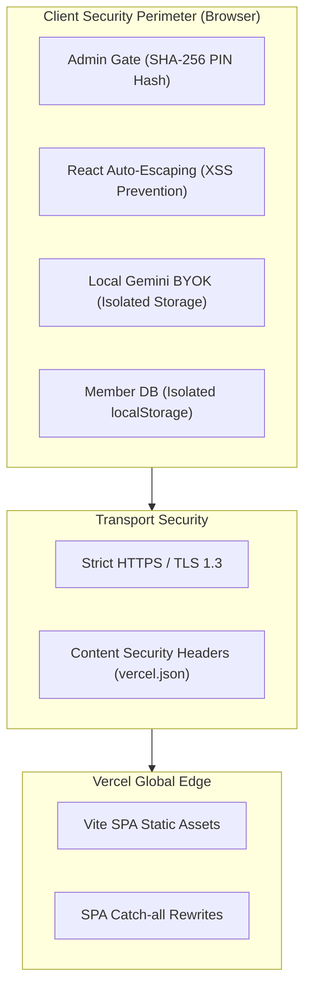

# 04 · SECURITY AND OPS
> **Smart Entrepreneurs Directory (SED)** — Security Architecture, Privacy Hardening & Vercel Ops Pipeline  
> **Deployment Target:** Vercel (Edge CDN Static SPA)

---

## 1. Security & Privacy Architecture



---

## 2. Security Controls & Threat Mitigations

### 2.1. Client-Side Data Isolation & Privacy-First Principle
- **Zero Third-Party Telemetry:** SED transmits zero member records or phone numbers to external tracking servers. All member profiles remain strictly inside browser `localStorage` or local disk DB.
- **BYOK (Bring Your Own Key) Storage:** The Google Gemini API key is stored strictly on the client machine in `localStorage`. It is never bundled into static production code or broadcast.

### 2.2. XSS & Content Injection Prevention
- **HTML Sanitization:** Raw WhatsApp message text and AI parser outputs are sanitized and rendered through React's auto-escaping JSX engine. Raw HTML injection (`dangerouslySetInnerHTML`) is prohibited.
- **WhatsApp Link Hardening:** Direct WhatsApp URLs (`https://wa.me/{phone}?text={encodedText}`) strictly encode parameters using `encodeURIComponent` to prevent protocol injection.

### 2.3. Admin Governance & PIN Authentication
- **PIN Verification:** Admin mode is gated behind a 4-to-6 digit PIN.
- **Cryptographic Hashing:** The master PIN is validated against a SHA-256 hash (`hashPIN`) rather than plain text comparisons.
- **Session Auto-Lock:** Admin session times out after 30 minutes of inactivity to protect shared devices.

---

## 3. Operational Deployment on Vercel

### 3.1. Build & Runtime Configuration

SED is configured as a static Single Page Application (SPA) on Vercel with SPA catch-all rewrites and security headers in `vercel.json`:

```json
{
  "$schema": "https://openapi.vercel.sh/vercel.json",
  "framework": "vite",
  "buildCommand": "npm run build",
  "outputDirectory": "dist",
  "rewrites": [
    {
      "source": "/(.*)",
      "destination": "/index.html"
    }
  ],
  "headers": [
    {
      "source": "/(.*)",
      "headers": [
        {
          "key": "X-Frame-Options",
          "value": "DENY"
        },
        {
          "key": "X-Content-Type-Options",
          "value": "nosniff"
        },
        {
          "key": "Referrer-Policy",
          "value": "strict-origin-when-cross-origin"
        },
        {
          "key": "Permissions-Policy",
          "value": "camera=(), microphone=(), geolocation=()"
        }
      ]
    },
    {
      "source": "/assets/(.*)",
      "headers": [
        {
          "key": "Cache-Control",
          "value": "public, max-age=31536000, immutable"
        }
      ]
    }
  ]
}
```

### 3.2. Environment Variables

| Variable Name | Environment | Required? | Description |
|---|---|---|---|
| `VITE_GEMINI_API_KEY` | Development / Staging | Optional | Default fallback Gemini API key for local preview |
| `VITE_APP_VERSION` | Production / All | Optional | Application version stamp for cache busting |

---

## 4. CI/CD Quality Gates & Release Commands

```bash
# 1. Static Analysis & Linting
npm run lint

# 2. Automated Unit Tests
npm test

# 3. Production Build Validation
npm run build

# 4. Dependency Security Audit
npm run audit:check
```

---

## 5. Backup, Disaster Recovery & Data Portability

- **JSON Database Snapshot Export:** Admins can export full database backups (`smart_directory_backup_YYYY-MM-DD.json`) with one click.
- **Schema Validation on Import:** Imported JSON files are validated against the `Member[]` schema before overwriting or merging with active records.
- **Rollback Seed Mode:** A master "Reset to Demo Seed Data" fallback is available in Admin governance in case of corrupted data.
